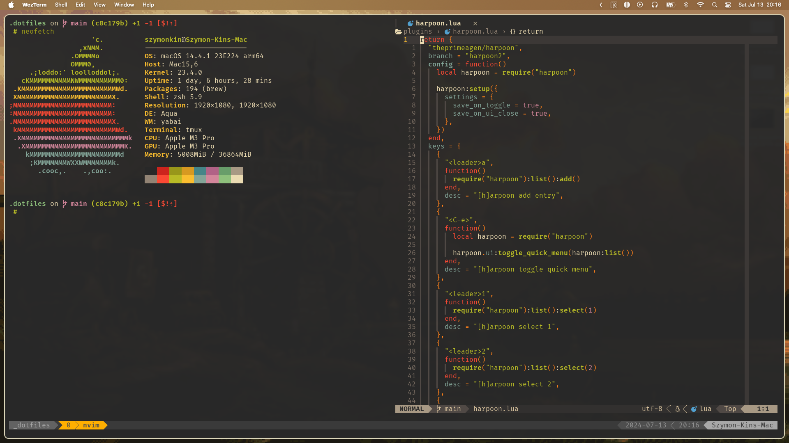

# Dotfiles

This repository contains my personal dotfiles and scripts.



## Core of the workflow

1. [Neovim](https://neovim.io/) - text editor
2. [Tmux](https://github.com/tmux/tmux) with custom sessionizer script - terminal multiplexer
3. Zsh - shell
4. [Aerospace](https://github.com/nikitabobko/AeroSpace) - i3-like tiling window manager
5. [Sketchybar](https://github.com/FelixKratz/SketchyBar) - customizable status bar

## Steps to bootstrap a new Mac

1. Install Apple's Command Line Tools, which are prerequisites for Git and Homebrew.

```zsh
xcode-select --install
```

2. Clone repo into new hidden directory.

```zsh
git clone git@github.com:hoolek77/dotfiles.git ~/.dotfiles
```

3. Install Homebrew, followed by the software listed in the Brewfile.

```zsh
# Install Homebrew
/bin/bash -c "$(curl -fsSL https://raw.githubusercontent.com/Homebrew/install/HEAD/install.sh)"

# Then run the bundle command in the dotfiles directory
cd ~/.dotfiles && brew bundle
```

4. Create symlinks with Stow.

```zsh
cd ~/.dotfiles && stow --target $HOME .
```
