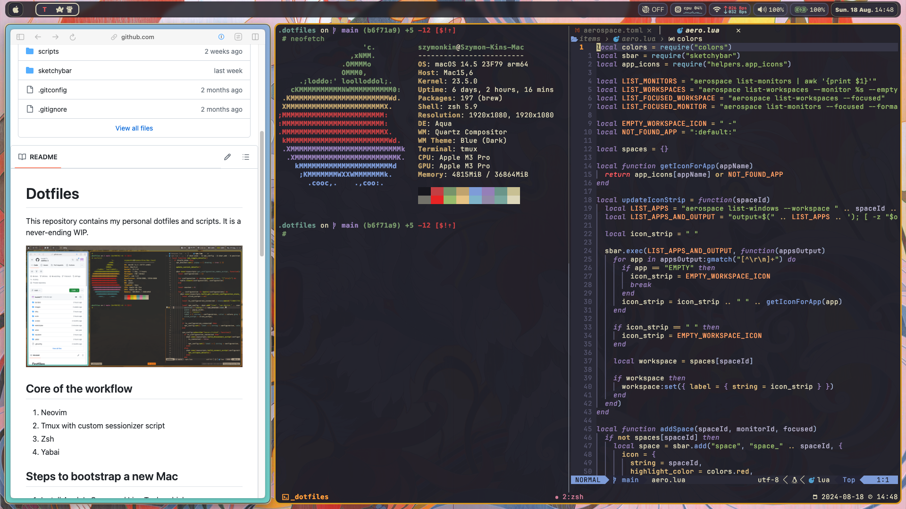

# Dotfiles

This repository contains my personal dotfiles and scripts.



## Core of the workflow

1. Neovim
2. Tmux with custom sessionizer script
3. Zsh
4. Aerospace

## Steps to bootstrap a new Mac

1. Install Apple's Command Line Tools, which are prerequisites for Git and Homebrew.

```zsh
xcode-select --install
```

2. Clone repo into new hidden directory.

```zsh
git clone git@github.com:hoolek77/dotfiles.git ~/.dotfiles
```

3. Create symlinks with Stow.

````zsh
stow --target $HOME .
```

4. Install Homebrew, followed by the software listed in the Brewfile.

```zsh
# These could also be in an install script.

# Install Homebrew
/bin/bash -c "$(curl -fsSL https://raw.githubusercontent.com/Homebrew/install/HEAD/install.sh)"

# Then run the bundle command in the dotfiles directory
cd ~/.dotfiles && brew bundle
````
